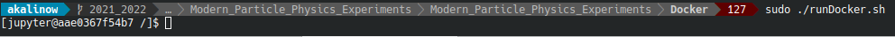
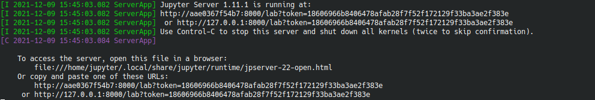

# Run instructions

During the class we will use multiple packages and programs specific for high energy physics. To avoid the burden of installing and configuring them on every machine, we will use virtual environments known as containers. 

You can check the full list of packages installed in the image we will use: [akalinow/root-fedora35](https://hub.docker.com/r/akalinow/root-fedora35).

## Running at computer lab 

An Apptainer/Singularity container for the Workshop is available from computers at the computer lab.
After login please run:

``` Shell
/dmj/staff/akalinow/Publiczny/Modern_Particle_Physics_Experiments/a9c7162efbb680bc20479f00578dbfe0ecac658e76461ae46ce889dfb6ea6b68
```

## Running at computer lab or any other computer **within** the Faculty network. Computers connected to FUW.Open or Eduroam are **not** within the faculty network

An Apptainer/Singularity containers are also available from a computing server of the Division of Elementary Particles and Interactions, ```zcobl3.hep.fuw.edu.pl```. This computer is available only from the internal Faculty network.


### Connect to the server 

``` Shell
ssh login@zcobl3.hep.fuw.edu.pl -XY
```

where for `login` use your own login name

### Run Apptainer/Singularity

``` Shell
./Modern_Particle_Physics_Experiments/Docker/runSingularity.sh
```

After this command, the prompt should change to `Apptainer>` which indicates that you are now inside the container.

Inside the container you can start the `jupyter-lab` with:

``` Shell
jupyter-lab --no-browser --ip=zcobl3.hep.fuw.edu.pl --notebook-dir=$HOME
```

The `jupyter` should write a bunch of lines to the terminal. Find and copy the URL starting with `http://zcobl3`, then open a web browser and paste it.

## Running on private computer

You can also install the software necessary to run containers on your private computer.

Depending on your system you can use either Apptainer/Singularity (Linux) or Docker (Windows, MacOs, Linux).

### Apptainer/Singularity (Linux only)

[Installation instructions](https://apptainer.org/user-docs/master/quick_start.html). Once installed you should be able to start it the same way as [at computer lab](#run-apptainersingularity).

### Docker (Windows, MacOs, Linux)

1. Installation instructions:

    - [Windows](https://docs.docker.com/docker-for-windows/),
    - [MacOS](https://docs.docker.com/docker-for-mac/install/),
    - [Linux](https://docs.docker.com/install/linux/docker-ce/fedora/).
    
    **Note**: after the installation one has to restart the computer.

2. Download the starting script and run it to start the container:
    - [runDocker.bat](runDocker.bat) on Windows,
    - [runDocker.sh](runDocker.sh) on MacOS and Linux:
        ```sh
        # download
        wget https://raw.githubusercontent.com/akalinow/Modern_Particle_Physics_Experiments/2022_2023/Docker/runDocker.sh
        # run
        . runDocker.sh
        ```

3. After starting the container one gets access to a terminal window:

    

4. Start the `jupyter-lab` with the `start-jupyter.sh` command:

    ```sh
    cd
    ./start-jupyter.sh
    ```

    In the terminal window you will see an information that server has started, and is available under given URL:

    

    Please copy the URL starting with `http://127.0.0.1` to web browser to start the jupyter client.

5. All files created within the container in `scratch` directory are visible in the host system:
    - on Windows in directory `Docker` located in the user directory,
    - on Linux in the home directory, `/home/$USER`.
    
 **Note:** put all your work under the `scratch` directory. All other files might be lost after closing the Docker, i.e computer restart.
 
 
 ## Using the faculty server zcobl3.hep.fuw.edu.pl from outside the Faculty network

The Faculty computers are only can be access through a gateway computer ```tempac```. In this case you need to make a "hop" through tempac before reaching zcobl3. This can be easily hidden with ssh configuration:

* Create a file (on Win or Linux): ```.ssh/config``` with following content: 

```Shell
Host zcobl3
     ForwardX11 yes
     ForwardAgent yes
     UserKnownHostsFile ~/.ssh/known_hosts
     Hostname zcobl3.hep.fuw.edu.pl
     LocalForward 8000 localhost:8000
     RequestTTY yes
     ProxyJump YOUR_LOGIN_ON_TEMPAC@tempac.okwf.fuw.edu.pl:22
     RemoteCommand ./Modern_Particle_Physics_Experiments/Docker/runSingularity.sh
     User YOUR_LOGIN_ON_ZCOBL3
```
* open terminal or PowerShell login, and start Jupyter:

```Shell
ssh zcobl3
jupyter-lab --no-browser --ip=0.0.0.0 –port=8000 --notebook-dir=$HOME
```

**Note**: every person connecting to the served has to use a different port number, ```8000``` here. Port change has to be done in two places
* the ```.ssh/config``` file
* the command running the jupyter-lab


